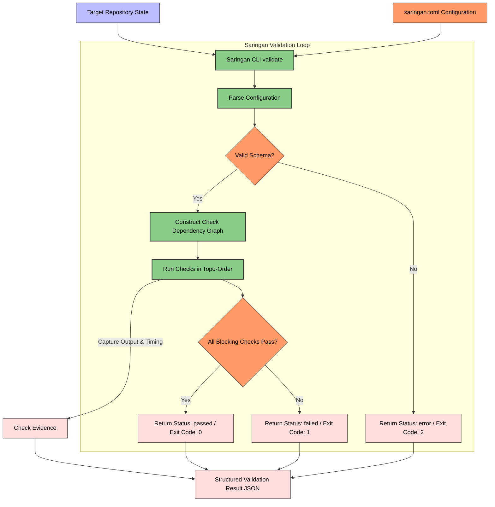

# Saringan: Automated QA & Quality Gate (Bersama Ecosystem)

[](https://www.python.org/)
[](#saringan-automated-qa--quality-gate)
[](https://opensource.org/licenses/Apache-2.0)

**Saringan** *(pronounced: "sah-rING-an", meaning filter or sieve)* is the automated QA and quality gate engine of the **Bersama** SDLC ecosystem. It provides a standalone, orchestrator-agnostic command-line tool that evaluates agent-produced code changes against deterministic static checks, test suites, and build verifications before code is eligible to merge.

> [!NOTE]
> This repository houses the standalone **Saringan CLI** (Deterministic Gate). It is designed to run independently in CI/CD pipelines, local development setups, or as a post-implementation verification step invoked by the [Rangkai](file:///home/ungku/programming/rangkai) orchestrator.

The ecosystem is built around two core architectural layers:
1. **Rangkai (Orchestrator):** A state-machine engine that claims issues, spins up isolated worktrees, executes agent harnesses, and manages task integration.
2. **Saringan (QA & Quality Gate):** A decoupled validation gate combining blocking deterministic checks with advisory contextual judgement (LLM-as-a-Judge) verification pipelines (contained in this repository).

---

## System Architecture & Workflow

The diagram below outlines how the Saringan CLI processes a target repository, parses declarative checks, runs validations matching dependency constraints, and produces a structured result:



---

## Core Architectural Concepts

### 1. Deterministic Gate
The first Saringan validation layer: a local, non-LLM gate made of repeatable static checks, tests, builds, and security scans executed directly within the agent's workspace or target directory.

### 2. Contextual Judge Gate
The second Saringan validation layer: an advisory-first, LLM-based judgement gate that evaluates code changes against issue context, acceptance criteria, and project conventions (LLM-as-a-Judge). The Contextual Judge Gate supports swappable **Judge Harnesses**—standalone processes that implement the [Judge Harness Protocol](docs/judge-harness-protocol.md)—as well as a built-in LiteLLM client and a legacy direct-model adapter. In this first implementation, the Contextual Judge Gate is advisory only and does **not** block merge eligibility—use `saringan validate` for the blocking Deterministic Gate.

### 3. Explicit & Declarative Configuration
Saringan adheres to strict **Explicit Configuration**—it runs only from a declared `saringan.toml` config file and does not infer validation behavior from repository heuristics. Checks are defined via **Declarative Configuration** naming parameters, dependencies, and policies without using ad-hoc shell scripting.

### 4. Aggregated Validation
Saringan collects outcomes from all runnable declared checks before returning a Validation Result. Rather than failing fast at the first error, Saringan provides a complete, aggregated report so that the invoking agent or developer receives comprehensive feedback for self-correction.

---

## Configuration (`saringan.toml`)

Saringan reads its configuration from the canonical `saringan.toml` file in the root of the target repository (or via the `--config` flag).

### Check Catalog — Stable Check IDs

Saringan identifies checks through canonical **Stable Check IDs**, which are `snake_case` names used in dependency resolution, configuration validation, and result reporting:
*   `command`: Generic custom command execution.
*   `javascript_lint`: JS/TS lint checks (e.g. eslint).
*   `javascript_tests`: JavaScript test execution (e.g. vitest, jest).
*   `javascript_build`: JS build validation (e.g. tsc, vite build).
*   `python_lint`: Python style and syntax check (e.g. ruff, flake8).
*   `python_typecheck`: Python type checker (e.g. pyright, mypy).
*   `python_tests`: Python unit test suites (e.g. pytest).
*   `secrets_scan`: Credentials/secrets detection scans (e.g. gitleaks).
*   `environment_file_guard`: Checks defending against committing env/secrets templates.

Deprecated kebab-case aliases (e.g. `secrets-scan`, `python-lint`) are accepted as configuration input but are normalized to the canonical `snake_case` Stable Check IDs before processing.

### Configuration Example

Below is a typical `saringan.toml` showcasing sequential dependencies and advisory checks:

```toml
schema_version = 1
log_dir = "logs/saringan"

[[checks]]
id = "secrets-scan"
type = "secrets_scan"
command = ["gitleaks", "detect", "--source=.", "--verbose", "--no-git"]

[[checks]]
id = "python-lint"
type = "python_lint"
command = ["ruff", "check", "src"]
depends_on = ["secrets-scan"]

[[checks]]
id = "python-typecheck"
type = "python_typecheck"
command = ["pyright", "src"]
depends_on = ["python-lint"]
advisory = true # Failures here won't block merges, but will be reported

[[checks]]
id = "python-tests"
type = "python_tests"
command = ["pytest"]
depends_on = ["python-lint"]
```

---

## Getting Started

### Prerequisites
*   Python `>= 3.12`
*   `git`

### Installation

Clone the repository and install in editable mode:

Using `uv` (recommended):
```bash
uv pip install -e .          # Deterministic Gate only
uv pip install -e ".[judge]"  # With built-in LLM client for Contextual Judge Gate (litellm, pydantic)
```

> [!NOTE]
> The `[judge]` extra is only required for the built-in LiteLLM direct-model path. Swappable Judge Harnesses (Pi headless, Codex headless, custom) do not require `litellm` or `pydantic`—they run as standalone subprocesses that communicate via the Judge Harness Protocol.

Or using standard `pip`:
```bash
python -m pip install -e .
python -m pip install -e ".[judge]"
```

### Running Tests

Execute the Pytest suite to verify the Saringan installation and configuration parser:

```bash
pytest
```

---

## CLI Usage

### Deterministic Gate (`saringan validate`)

Invoke the blocking Deterministic Gate against a target repository:

```bash
saringan validate <target_path> [--config <config_path>] [--log-dir <log_dir>]
```

| Argument / Option   | Required | Description |
|---------------------|----------|-------------|
| `target_path`       | Yes      | Path to the repository directory to validate. |
| `--config <path>`   | No       | Custom path to `saringan.toml` (defaults to `<target_path>/saringan.toml`). |
| `--log-dir <dir>`   | No       | Directory to save check output logs (overrides `log_dir` in `saringan.toml`). |

### Contextual Judge Gate (`saringan judge`)

Run the advisory Contextual Judge Gate against a diff and issue specification. The judge reads the diff, issue, and optional project conventions. By default, it submits them through the built-in LLM client (LiteLLM). When a **Judge Harness** is configured, the evaluation is delegated to a standalone harness process—see [Judge Harness Protocol](docs/judge-harness-protocol.md) for details.

The Contextual Judge Gate is not tied to any single model provider. It supports:
- **Built-in LLM client** (LiteLLM, the default when no harness is configured)
- **Swappable Judge Harnesses** (Pi headless, Codex headless, custom harnesses)
- **Legacy direct-model adapter** (migration-safe LiteLLM path behind the harness contract)

```bash
saringan judge <target_path> --diff <diff_path> --issue <issue_path> [--model <model>] [--conventions <conventions_path>] [--harness <name>] [--judge-config <path>] [--provider <name>] [--timeout <seconds>]
```

| Argument / Option         | Required | Description |
|---------------------------|----------|-------------|
| `target_path`             | Yes      | Path to the repository directory (used for result metadata). |
| `--diff <path>`           | Yes      | Path to a `diff` artifact (e.g., `git diff` output). File must exist. |
| `--issue <path>`          | Yes      | Path to the issue/context artifact (e.g., issue markdown). File must exist. |
| `--model <model>`         | No       | LLM model identifier (e.g., `openai/gpt-4o`). Overrides the harness-defined model. Defaults to `gpt-5` when no harness is configured. Recorded in the result payload. |
| `--conventions <path>`    | No       | Optional project conventions artifact. If provided, the file must exist. |
| `--harness <name>`        | No       | Named harness to use from the judge configuration. If no judge config is provided, treated as a raw harness command (backward compatible). Also settable via `SARINGAN_JUDGE_HARNESS`. |
| `--judge-config <path>`   | No       | Path to the judge harness configuration TOML file. Also settable via `SARINGAN_JUDGE_CONFIG`. |
| `--provider <name>`       | No       | Override the harness-defined provider. Also settable via `SARINGAN_JUDGE_PROVIDER`. |
| `--timeout <seconds>`     | No       | Override the harness-defined timeout in seconds. Also settable via `SARINGAN_JUDGE_TIMEOUT`. |

### Output Contract (stdout / stderr)

Saringan separates machine-readable and human-readable output across `stdout` and `stderr` for both `validate` and `judge`:

| Mode     | `stdout`                                | `stderr`                       |
|----------|-----------------------------------------|--------------------------------|
| Default  | Machine-readable Validation Result JSON | Human-readable progress lines  |

Callers parsing Saringan results MUST consume `stdout` — never scrape `stderr`, which is reserved for human-facing output.

### Exit Codes

| Code | Label    | Meaning |
|------|----------|---------|
| `0`  | `passed` | **Validate**: All configured blocking checks passed. **Judge**: Advisory evaluation completed and produced valid structured output. |
| `1`  | `failed` | One or more blocking checks failed (`validate` only). The judge command never returns exit code 1. |
| `2`  | `error`  | An environment failure occurred (e.g., missing input files, malformed configuration, judge dependencies not installed, invalid LLM response). |

---

## Validation Result Schema

### `saringan validate` Example Result

Saringan returns a structured Validation Result JSON payload:

```json
{
  "status": "passed",
  "target_path": "/home/ungku/programming/saringan",
  "config_path": "/home/ungku/programming/saringan/saringan.toml",
  "started_at": "2026-06-03T22:30:00.000000+00:00",
  "finished_at": "2026-06-03T22:30:02.123456+00:00",
  "message": null,
  "check_outcomes": [
    {
      "id": "secrets-scan",
      "stable_check_id": "secrets_scan",
      "status": "passed",
      "blocking": true,
      "evidence": {
        "stdout": "[gitleaks output...]",
        "stderr": "",
        "exit_code": 0,
        "duration_seconds": 0.45,
        "command": ["gitleaks", "detect", "--source=.", "--verbose", "--no-git"],
        "working_directory": "/home/ungku/programming/saringan"
      }
    },
    {
      "id": "python-lint",
      "stable_check_id": "python_lint",
      "status": "passed",
      "blocking": true,
      "evidence": {
        "stdout": "All checks passed.",
        "stderr": "",
        "exit_code": 0,
        "duration_seconds": 0.12,
        "command": ["ruff", "check", "src"],
        "working_directory": "/home/ungku/programming/saringan",
        "log_path": "/home/ungku/programming/saringan/logs/saringan/python-lint.log"
      }
    }
  ]
}
```

### `saringan judge` Example Result

The Contextual Judge Gate returns a `passed` status with advisory evidence when it completes successfully:

```json
{
  "status": "passed",
  "target_path": "/home/ungku/programming/saringan",
  "config_path": null,
  "started_at": "2026-06-04T12:00:00.000000+00:00",
  "finished_at": "2026-06-04T12:00:03.456789+00:00",
  "message": null,
  "check_outcomes": [
    {
      "id": "contextual_judge",
      "stable_check_id": "contextual_judge",
      "status": "passed",
      "blocking": false,
      "message": "Code changes satisfy the issue acceptance criteria.",
      "evidence": {
        "target_path": "/home/ungku/programming/saringan",
        "diff_path": "/tmp/changes.diff",
        "issue_path": "/tmp/issue.md",
        "conventions_path": null,
        "model": "openai/gpt-4o",
        "changed_files": ["src/app.js"],
        "scope_guard": {
          "verdict": "yes",
          "rationale": "All changed files map to the issue scope."
        },
        "advisories": [
          {
            "kind": "debug_artifact",
            "file": "src/app.js",
            "line": 10,
            "snippet": "print('TODO: remove')"
          }
        ],
        "acceptance_criteria": [
          {
            "criterion": "README documents installation",
            "verdict": "yes",
            "rationale": "Installation section documents pip install with judge extra."
          }
        ],
        "completion_score": 1.0,
        "input": {
          "diff_text": "diff --git a/src/app.js b/src/app.js\n...",
          "issue_text": "# Issue ...",
          "conventions_text": null
        }
      }
    }
  ]
}
```

> [!IMPORTANT]
> The `saringan judge` command is **advisory-first**. Exit code `0` means the judge completed successfully, not that the code is approved. The Contextual Judge Gate does **not** block merge eligibility in this first implementation. Use `saringan validate` for the blocking Deterministic Gate.

## Judge Harness

The Contextual Judge Gate supports swappable harness execution. Instead of calling a model directly, Saringan can delegate evaluation to a standalone harness process that reads judge context from stdin, writes a structured result artifact, and returns diagnostics on stdout/stderr.

See [Judge Harness Protocol](docs/judge-harness-protocol.md) for the full protocol contract, configuration reference, CLI/env overrides, and Rangkai Integration guidance.

### Quick Config Example

```toml
default_harness = "pi"

[[harnesses]]
name = "pi"
provider = "anthropic"
model = "claude-sonnet-4"
command = ["python3", "-m", "pi_harness", "--provider", "{provider}", "--model", "{model}"]
timeout = 300

[[harnesses]]
name = "codex-headless"
provider = "openai"
model = "gpt-5"
command = ["node", "codex-runner.js", "--model", "{model}"]
timeout = 600
```

Usage:
```bash
# Via CLI flags
saringan judge . --diff changes.diff --issue issue.md --judge-config judge.toml --harness codex-headless

# Via environment variables (for CI / Rangkai Integration)
export SARINGAN_JUDGE_CONFIG=judge.toml
export SARINGAN_JUDGE_HARNESS=codex-headless
saringan judge . --diff changes.diff --issue issue.md
```

---

## License

Licensed under the Apache License, Version 2.0. See [LICENSE.md](https://opensource.org/licenses/Apache-2.0) for details.
