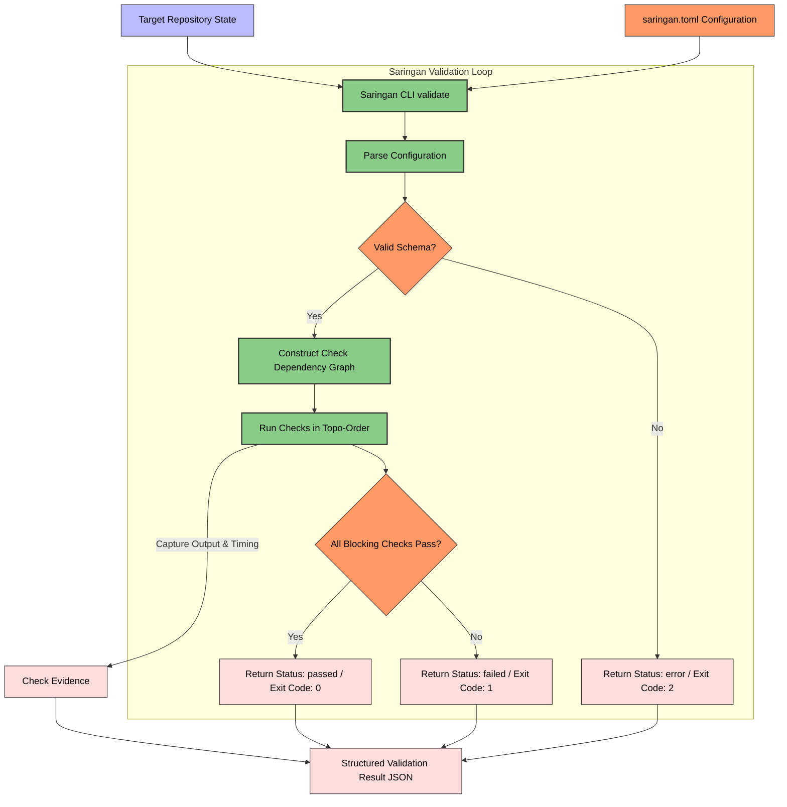

# Saringan: Automated QA & Quality Gate (Bersama Ecosystem)

[](https://www.python.org/)
[](#saringan-automated-qa--quality-gate)
[](https://opensource.org/licenses/Apache-2.0)

**Saringan** *(pronounced: "sah-rING-an", meaning filter or sieve)* is the automated QA and quality gate engine of the **Bersama** SDLC ecosystem. It provides a standalone, orchestrator-agnostic command-line tool that evaluates agent-produced code changes against deterministic static checks, test suites, and build verifications before code is eligible to merge.

> [!NOTE]
> This repository houses the standalone **Saringan CLI** (Deterministic Gate). It is designed to run independently in CI/CD pipelines, local development setups, or as a post-implementation verification step invoked by the [Rangkai](file:///home/ungku/programming/rangkai) orchestrator.

The ecosystem is built around two core architectural layers:
1. **Rangkai (Orchestrator):** A state-machine engine that claims issues, spins up isolated worktrees, executes agent harnesses, and manages task integration.
2. **Saringan (QA & Quality Gate):** A decoupled validation gate combining deterministic checks with future contextual judgement (LLM-as-a-Judge) verification pipelines (contained in this repository).

---

## System Architecture & Workflow

The diagram below outlines how the Saringan CLI processes a target repository, parses declarative checks, runs validations matching dependency constraints, and produces a structured result:



---

## Core Architectural Concepts

### 1. Deterministic Gate
The first Saringan validation layer: a local, non-LLM gate made of repeatable static checks, tests, builds, and security scans executed directly within the agent's workspace or target directory.

### 2. Contextual Judge Gate
The future Saringan validation layer that evaluates code changes against issue context and project conventions using LLM-based judgement (LLM-as-a-Judge).

### 3. Explicit & Declarative Configuration
Saringan adheres to strict **Explicit Configuration**—it runs only from a declared `saringan.toml` config file and does not infer validation behavior from repository heuristics. Checks are defined via **Declarative Configuration** naming parameters, dependencies, and policies without using ad-hoc shell scripting.

### 4. Aggregated Validation
Saringan collects outcomes from all runnable declared checks before returning a Validation Result. Rather than failing fast at the first error, Saringan provides a complete, aggregated report so that the invoking agent or developer receives comprehensive feedback for self-correction.

---

## Configuration (`saringan.toml`)

Saringan reads its configuration from the canonical `saringan.toml` file in the root of the target repository (or via the `--config` flag).

### Check Catalog Types
Saringan understands the following check types in its standard catalog:
*   `command`: Generic custom command execution.
*   `javascript-lint`: JS/TS lint checks (e.g. eslint).
*   `javascript-tests`: JavaScript test execution (e.g. vitest, jest).
*   `javascript-build`: JS build validation (e.g. tsc, vite build).
*   `python-lint`: Python style and syntax check (e.g. ruff, flake8).
*   `python-typecheck`: Python type checker (e.g. pyright, mypy).
*   `python-tests`: Python unit test suites (e.g. pytest).
*   `secrets-scan`: Credentials/secrets detection scans (e.g. gitleaks).
*   `environment-file-guard`: Checks defending against committing env/secrets templates.

### Configuration Example

Below is a typical `saringan.toml` showcasing sequential dependencies and advisory checks:

```toml
schema_version = 1
log_dir = "logs/saringan"

[[checks]]
id = "secrets-scan"
type = "secrets-scan"
command = ["gitleaks", "detect", "--source=.", "--verbose", "--no-git"]

[[checks]]
id = "python-lint"
type = "python-lint"
command = ["ruff", "check", "src"]
depends_on = ["secrets-scan"]

[[checks]]
id = "python-typecheck"
type = "python-typecheck"
command = ["pyright", "src"]
depends_on = ["python-lint"]
advisory = true # Failures here won't block merges, but will be reported

[[checks]]
id = "python-tests"
type = "python-tests"
command = ["pytest"]
depends_on = ["python-lint"]
```

---

## Getting Started

### Prerequisites
*   Python `>= 3.12`
*   `git`

### Installation

Clone the repository and install in editable mode:

Using `uv` (recommended):
```bash
uv pip install -e .
```

Or using standard `pip`:
```bash
python -m pip install -e .
```

### Running Tests

Execute the Pytest suite to verify the Saringan installation and configuration parser:

```bash
pytest
```

---

## CLI Usage

Invoke Saringan against a target repository directory path:

```bash
saringan validate <target_path> [options]
```

### Options
*   `target_path`: The path to the repository directory to validate.
*   `--config <config_path>`: Optional custom path to `saringan.toml` (defaults to `<target_path>/saringan.toml`).
*   `--log-dir <log_dir>`: Optional directory to save check output logs (overrides `log_dir` in `saringan.toml`).
*   `--json`: Outputs the final result as a machine-readable JSON structure on stdout.

### Exit Codes
Saringan communicates the overall validation state via standard exit codes:
*   `0` (`passed`): All configured blocking checks passed successfully.
*   `1` (`failed`): One or more blocking checks failed.
*   `2` (`error`): An environment failure or configuration error occurred (e.g., malformed config, missing directory).

---

## Validation Result Schema

When run with the `--json` flag, Saringan returns a structured Validation Result JSON payload:

```json
{
  "status": "passed",
  "target_path": "/home/ungku/programming/saringan",
  "config_path": "/home/ungku/programming/saringan/saringan.toml",
  "started_at": "2026-06-03T22:30:00.000000+00:00",
  "finished_at": "2026-06-03T22:30:02.123456+00:00",
  "message": null,
  "check_outcomes": [
    {
      "id": "secrets-scan",
      "status": "passed",
      "blocking": true,
      "evidence": {
        "stdout": "[gitleaks output...]",
        "stderr": "",
        "exit_code": 0,
        "duration_seconds": 0.45,
        "command": ["gitleaks", "detect", "--source=.", "--verbose", "--no-git"],
        "working_directory": "/home/ungku/programming/saringan"
      }
    },
    {
      "id": "python-lint",
      "status": "passed",
      "blocking": true,
      "evidence": {
        "stdout": "All checks passed.",
        "stderr": "",
        "exit_code": 0,
        "duration_seconds": 0.12,
        "command": ["ruff", "check", "src"],
        "working_directory": "/home/ungku/programming/saringan",
        "log_path": "/home/ungku/programming/saringan/logs/saringan/python-lint.log"
      }
    }
  ]
}
```

---

## License

Licensed under the Apache License, Version 2.0. See [LICENSE.md](https://opensource.org/licenses/Apache-2.0) for details.
